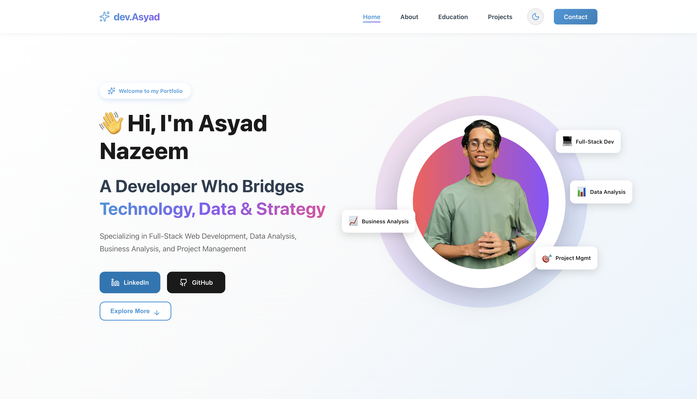
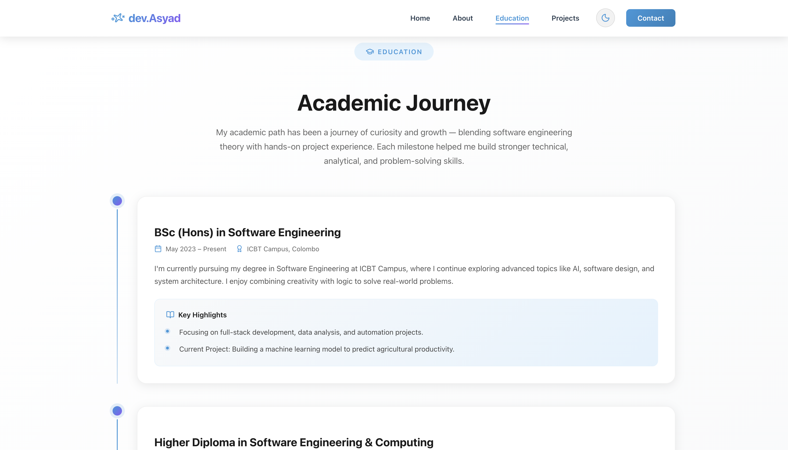
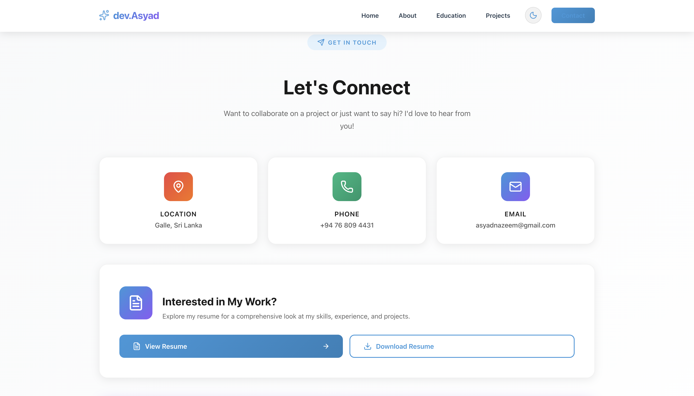

# 🌐 Asyad Nazeem — Developer Portfolio

A modern and interactive **personal portfolio website** showcasing my projects, education, and experience as a **Software Engineering Graduate** and **Full Stack Developer**.  
Built to demonstrate both technical skills and clean UI design.

---

## 🚀 Overview

This portfolio highlights my journey in **Full Stack Development**, **Data Analysis**, and **Business Analysis**.  
It includes a collection of hands-on projects ranging from ERP systems and AI-driven disease detection to Excel-based business insights.

---

## ✨ Features

- 🎨 **Responsive Design** — fully optimized for desktop and mobile.  
- 🌙 **Dark/Light Mode Toggle** using Context API.  
- ⚡ **Smooth Scroll Navigation** with active link highlighting.  
- 🧩 **Project Gallery** with detailed modals and image carousels.  
- 🗂️ **Dynamic Data Rendering** — projects managed via modular JSON objects.  
- 🧠 **Clean, Minimal & Accessible UI** with Tailwind CSS and React hooks.  

---

## 🧰 Tech Stack

| Category | Technologies |
|-----------|---------------|
| **Frontend** | React.js, Vite, Tailwind CSS |
| **Libraries** | Lucide Icons, React Scroll, React Icons |
| **Deployment** | GitHub Pages |
| **Version Control** | Git & GitHub |

---

## 🗂️ Folder Structure

```
my-portfolio/
├── src/
│ ├── components/
│ │ ├── Navbar.jsx
│ │ ├── ProjectCard.jsx
│ │ ├── DarkModeToggle.jsx
│ │ └── ...
│ ├── data/
│ │ └── projects.js
│ ├── styles/
│ └── main.jsx
├── public/
├── package.json
└── README.md
```
---

## ⚙️ Setup & Installation

To run this project locally:

```bash
# Clone the repository
git clone https://github.com/AsyadNazeem/My-Portfolio.git

# Navigate into the project folder
cd My-Portfolio

# Install dependencies
npm install

# Start the local development server
npm run dev
```
---

🌍 Deployment

Deployed via GitHub Pages:
👉 https://asyadnazeem.github.io/My-Portfolio

---

🖼️ Screenshots

Section	Screenshot

### 1. Home Page	
  

Projects	
### 2. Projects Page	
  

Education	
### 2. Education Page	
  

Contact	
### 2. Contact Page	
  

---

📂 Featured Projects

Some projects showcased in this portfolio:

Mubarak Products – Business Website (React, Tailwind, Vite)

Parkinson’s Disease Detection – AI-Driven Health App (Laravel, Python, Streamlit, Scikit-learn)

Enterprise Resource Planning System – Full Stack Web App (PHP, MySQL, JS)

Sales Data Analysis & Visualization – Excel Dashboard using Pivot Tables & Data Cleaning

Advanced SQL Automation – Employee Data Analysis using Window Functions, CTEs & Triggers

---

👨‍💻 Author

Asyad Nazeem
Software Engineering Graduate | Full Stack Developer | Data & Business Analyst

🔗 Portfolio Website

💼 LinkedIn

📧 asyadnazeem@gmail.com

---

📜 License

This project is open-sourced under the MIT License — feel free to use and modify for personal learning or inspiration.

